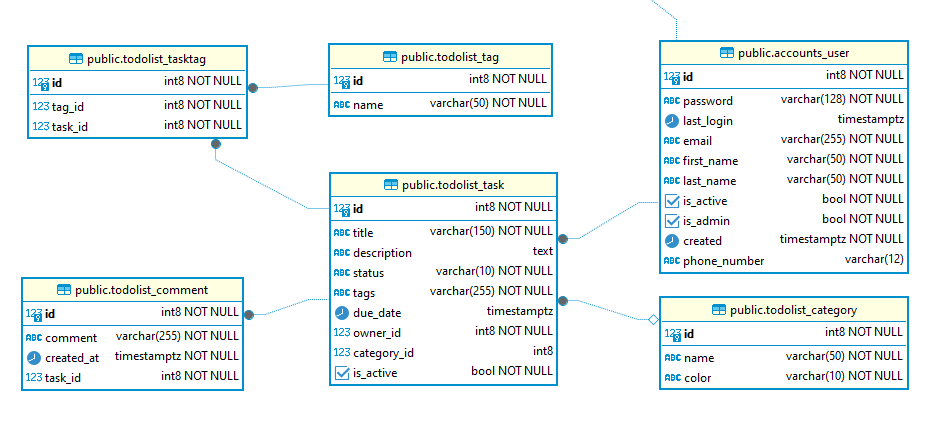
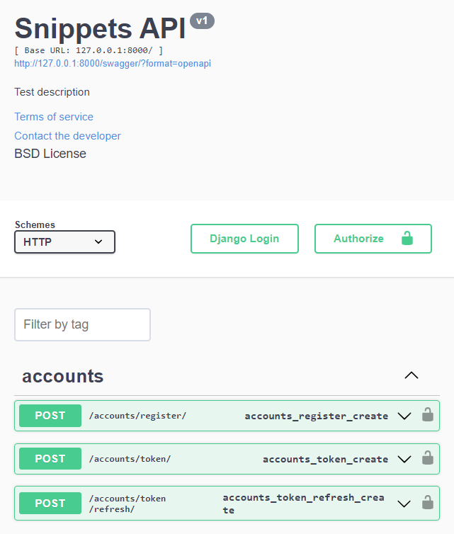
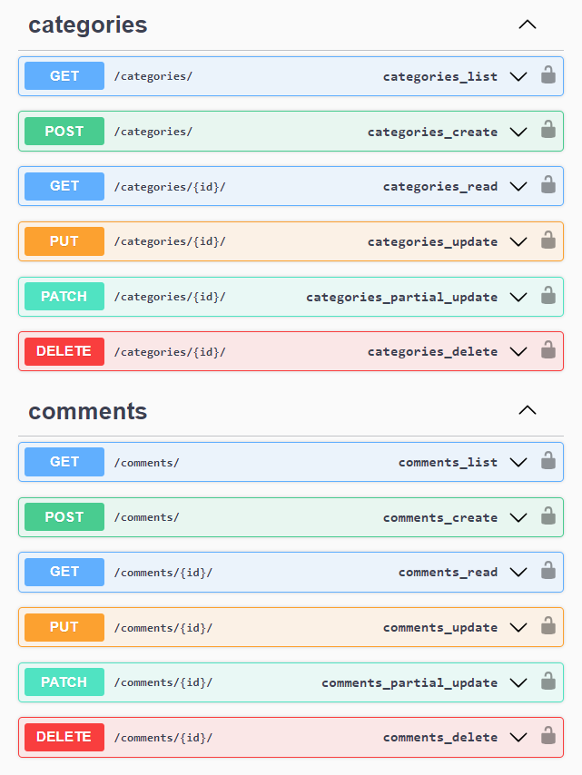
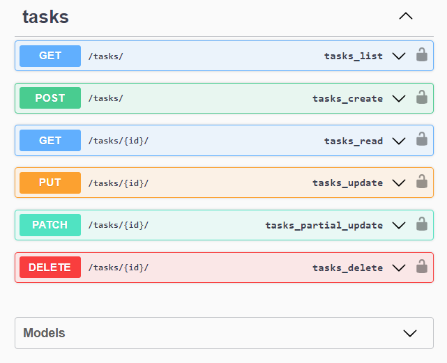

# To-Do List

Веб-приложение для управления личными задачами.
В нем предусмотрена функциональность для создания,
редактирования, удаления задач,
а также для управления категориями, тегами и комментариями к задачам.

Приложение разработано с использованием Django и
Django REST Framework (DRF). Для аутентификации
используется JSON Web Token (JWT), также предусмотрено
кеширование с использованием Redis, асинхронные
задачи с использованием Celery и работа с переменными окружения.

## Схема данных

База данных реализована на PostgreSQL

1. Модель `User`. В качестве основного поля для авторизации
   используется `email`. Добавлены поля с уникальной комбинацией
   `first_name` и `last_name` и необязательное поле `phone` с проверкой
   на формат ввода. Любой пользователь может быть владельцем (owner) любого количества задач.
2. Модели `Task`, `Category`, `Comment` и `Tag` - основные сущности проекта.
   У каждой задачи может быть несколько
   комментариев, а одна задача может иметь
   множество тегов, и один тег может быть связан с
   множеством задач. Каждая задача принадлежит одному пользователю.
   Каждая задача принадлежит одной категории или не имеет таковой.
   Модель `Task` дополнена полем `status` ('Черновик'/'Опубликована')
   и полем `is_active`, активна ли задача в данный момент.
   В модели `Task` реализован метод записи тегов через запятую.
   При этом теги привязываются к задаче, не дублируются в модели `Tag`
   и проходят валидацию в соответствии с установленными критериями.

## Реализация

### Админ-панель

Представлены таблицы:

+ Пользователи. Поля: email, phone, first name, last name, is admin
+ Задачи. Поля: Имя задачи, Категория, Владелец, Срок выполнения, Статус, Активность.
  Фильтр: Владелец, Категория, Статус, Активность.
  Начальная сортаровка: Срок выполнения по убыванию.
  Поиск: Имя и описание задачи. При просмотре задачи отображается список комментариев.
+ Категории
+ Теги

### Пользовательская аутентификация

Регистрация, авторизация и аутентификация пользователя
проходит с использованием JWT-токенов в соответствии с документацией.

### Контроллеры

Созданы контроллеры для моделей `Task`, `Category` и `Comment`,
которые позволят делать запросы на создание, изменение,
удаление и просмотр сущностей моделей.
В контроллере задач используется сериализатор, который
отображает количество комментарием и список комментариев,
связанных с задачей.
Настроена маршрутизация адресов
для каждого созданного контроллера. Маршрутизация и параметры отражены в документации.

### Ограничение доступа

Закрыт доступ ко всем эндпоинтам для неавторизованных пользователей.
Добавлена проверка владельца задачи при ее просмотре, редактировании
или удалении. Пользователь может работать только своими задачи.
При удалении задачи,
она реально не удаляется, она переходит в состояние `is_active=False`.
Категории для просмотра доступны всем авторизированным
пользователям, но при этом только пользователи со
статусом администратор (`is_admin=True`) могут
добавлять, изменять или удалять категории.

### Кеширование

Кеширование настроено с использованием Redis.
Закеширован контроллер со списком комментариев,
которые принадлежат задачам текущего пользователя.
Также выполнено кеширование на уровне представления комментариев.
При добавлении, изменении или удалении комментария
выполняется инвалидация кеше.

### Асинхронные задачи

Асинхронные задачи в проекте реализованы через Celery
с использованием Redis в качестве брокера сообщений.
В фоне выполняется проверка комментариев на наличие
запрещенных слов и их замены на символы ###.
Реализована задача, которая запускается раз в сутки
и проверяет все активные (is_active=True) задачи,
имеющие статус "Опубликована" на наступление дедлайна.
Если дедлайн наступил, то срок выполнения задачи сдвигается
автоматически на день вперед.

### Переменные окружения

Для работы с переменными окружения использована библиотека
python-decouple. Все чувствительные переменные венесены
в файл **.env**.

### Тестирование

Написаны тесты для моделей Task и Category и
интеграционный тест на создание комментариев к задачам.

### Документация API

Для генерации документации API использована библиотека drf-yasg.

+ http://127.0.0.1:8000/swagger/
+ http://127.0.0.1:8000/redoc/

